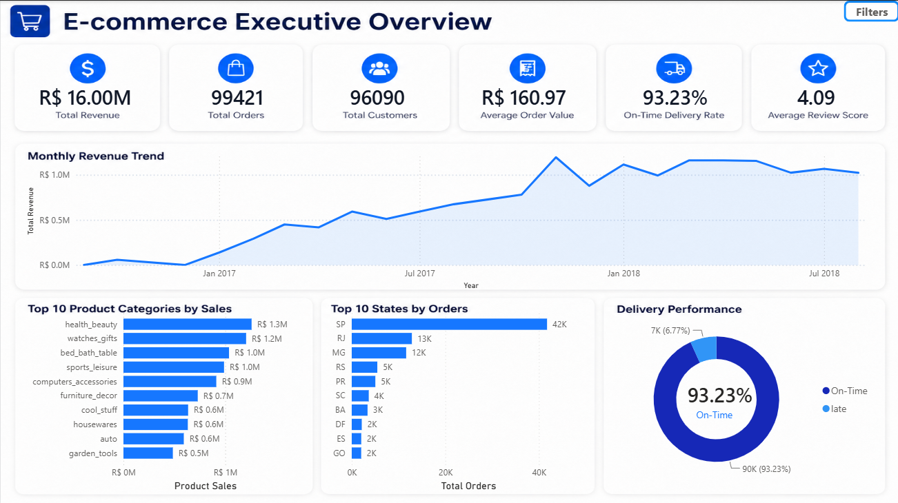
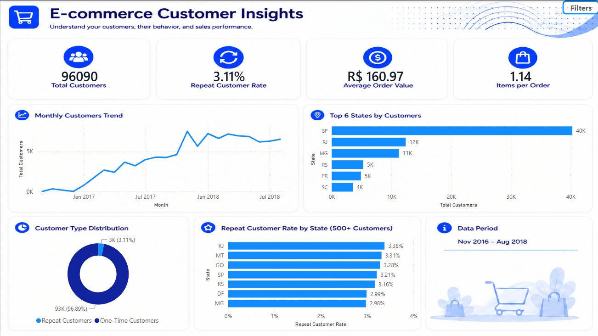
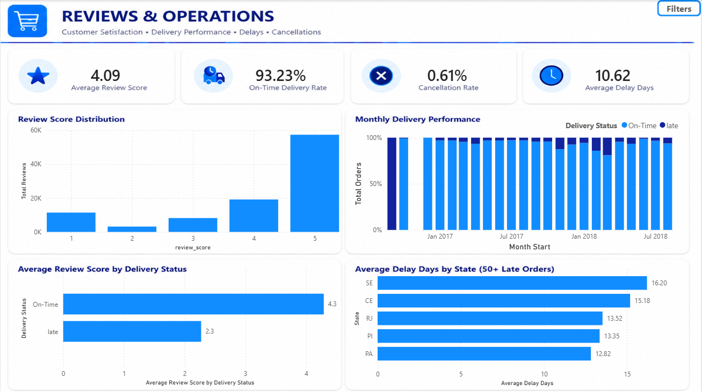

# Olist E-commerce Analytics

## Project Overview
End-to-end e-commerce analysis of the Brazilian Olist dataset using SQL, Python, Power Query, DAX, and Power BI.

The project focuses on sales performance, customer behavior, delivery operations, and customer satisfaction.

## Tools
- Power BI
- Power Query
- DAX
- SQL Server
- Python
- Pandas
- Matplotlib

## Dashboard Pages
### Executive Overview


### Customer Insights


### Reviews & Operations


## Key KPIs
- Total Revenue: **R$16.00M**
- Total Orders: **99,421**
- Total Customers: **96,090**
- Average Order Value: **R$160.97**
- On-Time Delivery Rate: **93.23%**
- Average Review Score: **4.09**
- Repeat Customer Rate: **3.11%**
- Cancellation Rate: **0.61%**
- Average Delay Days: **10.62**

## Key Insights
- São Paulo is the largest market by both customers and orders.
- Repeat customers represent only about **3.11%** of customers.
- On-time delivery performance is approximately **93.23%**.
- On-time orders receive an average review score of about **4.29**, compared with **2.27** for late orders.
- Five-star reviews make up the largest share of customer feedback.
- Some states experience significantly higher average delivery delays.

## Data Preparation
Power Query was used for:
- Data type validation
- Missing value checks
- Category translation
- Geography cleanup
- Table merging
- Dimensional modeling preparation

September and October 2018 were excluded because they contained incomplete order activity.

## SQL Analysis
SQL was used to validate and reproduce core business metrics, including:
- Orders by status
- Orders by state
- Product category sales
- Delivery performance
- Repeat customer rate
- Repeat customer rate by state
- Product category ranking
- Review score by delivery status

See:
`SQL/olist_ecommerce_analysis.sql`

## Python Analysis
Python was used for validation and exploratory analysis of:
- Delivery status
- On-time delivery rate
- Delay days
- Review scores by delivery status
- Delay outliers using the IQR method

See:
`Python/olist_ecommerce_analysis.ipynb`

## Power BI
The Power BI report contains:
- Interactive date and state filters
- Synced slicers
- Collapsible filter panel
- DAX KPIs
- Three dashboard pages

See:
`PowerBI/Olist_Ecommerce_Analytics.pbix`

## Dataset
Brazilian E-Commerce Public Dataset by Olist.

The raw CSV files are not included in this repository to keep it lightweight.

See:
`Data/README.md`

## Project Structure
```text
olist-ecommerce-analytics/
│
├── Data/
│   └── README.md
├── PowerBI/
│   └── Olist_Ecommerce_Analytics.pbix
├── Python/
│   └── olist_ecommerce_analysis.ipynb
├── Screenshots/
│   ├── executive-overview.png
│   ├── customer-insights.png
│   └── reviews-operations.png
├── SQL/
│   └── olist_ecommerce_analysis.sql
└── README.md
